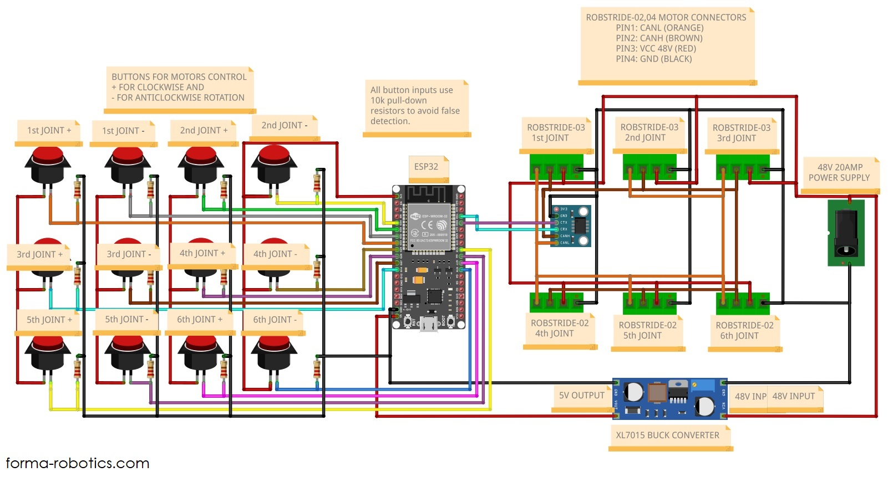

# Forma Arm
Welcome to the official repository for **Forma Robotics' open-source robotic arm**.  
This project aims to make robotics accessible to anyone — builders, researchers, students, and hobbyists.  
Everything here is **modular, open-source, and designed for real-world deployment**.

## Overview
Forma’s robotic arm is built around:
- **Modular hardware** — interchangeable joints and planetary gearboxes
- **Affordable manufacturing** — designed for easy fabrication using 3D printing
- **RaaS (Robotics-as-a-Service) ready** — intended for deployment to the Forma decentralized network

## Electronics
### Circuit Diagram

## CAD
The following CAD components are currently available in this repo:
- ✅ Base link (mounting structure for the first joint)
- ✅ Link1 (first arm segment connected to the base + lid)
- ✅ Link2 (second arm segment connected to the Link1)
- ✅ Servo module components

## Bill of Materials (BoM) 📦

### 🔩 Hardware (Screws)
| Component                      | Standard                   | Size (mm)   |Quantity|
|:--------------------------------:|:----------------------------:|:---------:|:-------:|
| Base assembly screws           | ISO 4762 (Hex Socket Head) | M6 × 25 | 6 pcs |
| Servo mounting screws (RS03 - back)   | ISO 4762 (Hex Socket Head) | M4 × 16 | 8 pcs |
| Servo mounting screws (RS03 - front) | ISO 4762 (Hex Socket Head) | M4 × 10 | 12 pcs |

---

### ⚙️ Servo Motors
| Quantity | Model               | Peak Torque   | Link |
|:----------:|:---------------------:|:---------------|:------:|
| 3        | ROBSTRIDE 03        | 60 N·m        | https://aifitlab.com/products/robstride-03-motor |
| 3        | ROBSTRIDE 02        | 17 N·m        | https://aifitlab.com/products/robstride-02-motor |

More parts (electronics, end-effector BOM) will be added as the arm progresses.

## Contributing 🤝
We welcome:
- Design improvements
- Bug reports
- Pull requests
- New attachments/end-effectors

Please fork the repo, create a feature branch and open a pull request.